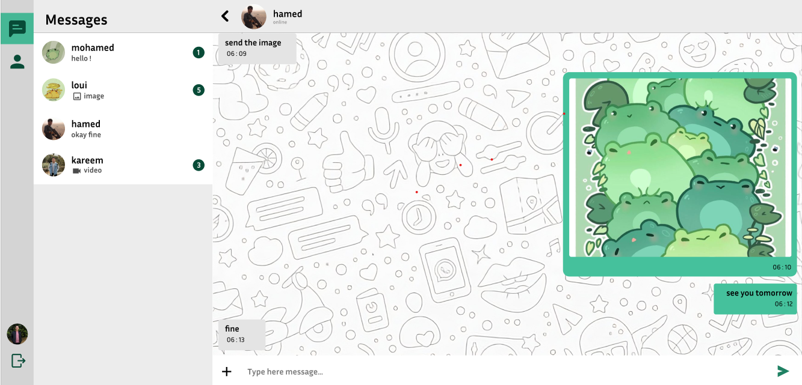

# Chat-Ease

  
  

Chat-Ease is a real-time chat application designed to facilitate seamless communication between users. It offers an intuitive interface and modern features to enhance user interaction, ensuring a responsive and engaging experience.

## Key Features

- **User Registration and Authentication:** Secure user sign-up and login functionality.
- **Profile Management:** Update and manage user profiles with ease.
- **Real-Time Messaging:** Instant messaging powered by **Socket.io**.
- **User Search:** Find other users with an integrated search feature.
- **Media File Uploads:** Share images and videos via **Cloudinary**.
- **Online Status Indicators:** View real-time online status of users.

## Technologies Used

### Frontend

- **React:** Building the user interface.
- **Redux:** State management for predictable data flow.
- **React Router:** Client-side routing for a seamless navigation experience.
- **Axios:** HTTP requests for data fetching.
- **Tailwind CSS:** Styling the interface with modern design principles.
- **Socket.io-client:** Real-time communication between users.
- **React Icons:** Icon library for enhanced visuals.
- **Moment.js:** Formatting dates and times.

### Backend

- **Node.js:** Server-side JavaScript runtime.
- **Express:** RESTful API development.
- **MongoDB:** Database management.
- **Mongoose:** Object Data Modeling (ODM) for MongoDB.
- **Socket.io:** Real-time communication.
- **JWT (JSON Web Tokens):** Secure user authentication.
- **Cloudinary:** Cloud storage for media files.

## Project Structure

- **Client:** Contains the React frontend application.
- **Server:** Contains the Node.js backend application.

## Overview

Chat-Ease aims to provide a robust and secure platform for real-time communication, leveraging modern web technologies for a smooth and feature-rich user experience. Explore Chat-Ease and enjoy effortless connectivity with friends and colleagues!
